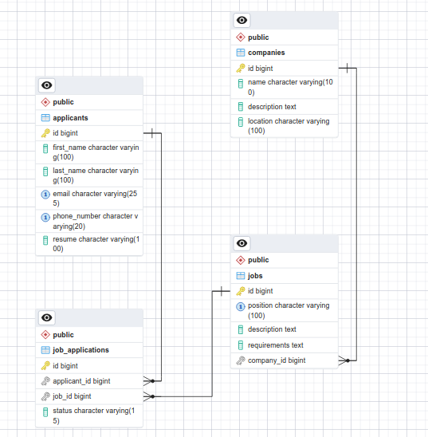
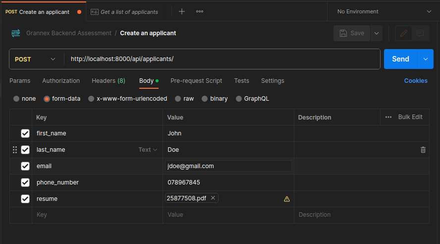
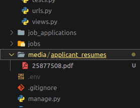

# Ajiri API

An API that keeps track of different job opportunities and applicants

## Getting Started

### Prerequisites

Ensure you have the following installed:

- [Python](https://www.python.org/downloads/) (version 3.6 or higher)
- [pip](https://pip.pypa.io/en/stable/installation/) (Python package installer)
- PostgreSQL Database (and optionally, PgAdmin)

### Create a virtual environment

1. Open a terminal or command prompt.

2. Navigate to the project directory:

   ```bash
    cd /path/to/your/project
   ```

3. Create a virtual environment

   ```bash
    python -m venv venv
   ```

If you are you are on a Linux machine, use python3, instead

4.Activate the virtual environment:

- On Windows:

    ```bash
    venv\Scripts\activate
    ```

- On macOS/Linux:

    ```bash
        source venv/bin/activate
    ```

Once activated, your terminal prompt should change to indicate the virtual environment

### Installing Dependencies

1. Ensure the virtual environment is activated.
2. Install the project dependencies using pip and the requirements.txt file:

    ```bash
        pip install -r requirements.txt
    ```

If you are you are on a Linux machine, use pip3, instead

### Before running the project

1. Create a database in PostgreSQL with the name 'ajiri'
2. Create a .env file in the root directory of the project and set the following variables:

    ```bash
        DBUSER=your-database -username
        DBPASSWORD=-your-users-password
    ```

3. In your terminal, navigate to your project directory and run:

    ```bash
        python manage.py makemigrations
    ```

    then:

    ```bash
        python manage.py migrate
    ```

This last command creates the required tables in the **ajiri** database

### Running the project

- To execute the project, run:

    ```bash
        python manage.py runserver 8000
    ```

## Database Schema

This database schema was used for the exercise



## Postman collection

The following resource contains a published collection of the API Endpoints for Ajiri API:

[Ajiri Postman Collection](https://documenter.getpostman.com/view/21484054/2s9Ye8gahP)

## Exercise approach

1. [Adding a List of jobs](https://documenter.getpostman.com/view/21484054/2s9Ye8gahP#e784e488-3c49-4874-a422-9aa69d8e1327)

2. Taking the names of applicants, job applied and resumes and adding them to a DB.

    Since the database tables had relationships, I followed the following process:
    - [Create an applicant](https://documenter.getpostman.com/view/21484054/2s9Ye8gahP#3a995bad-7c51-4344-9881-670421ef2b64)
    - [Create a company](https://documenter.getpostman.com/view/21484054/2s9Ye8gahP#bdee139e-fb28-48fb-a14b-bff74670c87f)
    - [Create a job application](https://documenter.getpostman.com/view/21484054/2s9Ye8gahP#289f0632-3b0e-46d6-bc02-b48db4a82f24)

    When creating an applicant, ensure you use **form-data** because you will be making a multi-part request

    

    The uploaded file is stored in the media folder in your project's directory, specifically in ```media/applicant_resumes``` directory

    

    The files are stored in the mentioned directory while their paths are stored in the database

3. [Returning applicant details and jobs applied](https://documenter.getpostman.com/view/21484054/2s9Ye8gahP#f32e62dc-73cb-47fd-a59a-3c3a9ac7664d)

## Additional functionality attempted

1. [Filtering job applications by company](https://documenter.getpostman.com/view/21484054/2s9Ye8gahP#177757d4-168f-4843-8d0e-b745ce502bd2)
2. [Filtering job applications by applicant](https://documenter.getpostman.com/view/21484054/2s9Ye8gahP#a3c3f79c-c0fa-4554-a469-66c373502e80)

The above are important for copmanies and individuals to view applications that are specific to them

## Careful considerations

1. An applicant can only apply for a specific job once
2. Only job applications with the status 'Under Review' or 'Applied' can be updated

### Running project tests

- To execute the project tests, run:

    ```bash
        python manage.py test
    ```
